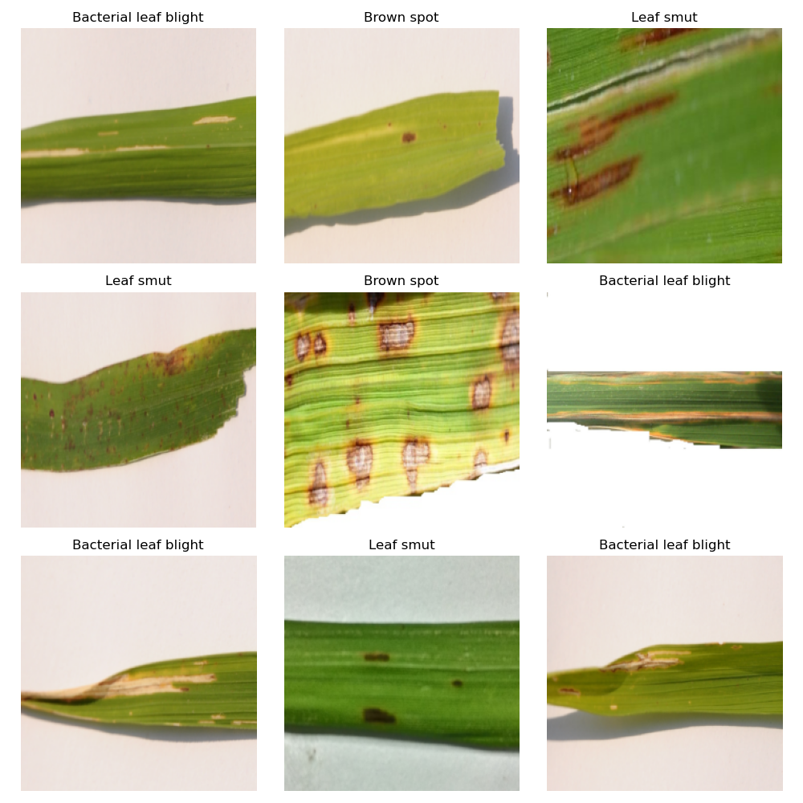

# Rice Leaf Disease Classificaiton Using Pytorch

This project aims to classify rice leaf diseases using a classic resetnet architecture based image classification task is prefromed with the pytorch. Whats new in this project? I have utilized the GPU and CPU to parallelize the all operations. Pytorch is amazingly good at the parallleizing the model traing, and inferance, where as in the most of the pipelines the bottleneck could be the preprocessing step. So, to tackle that issue, I have used the python multiprocessing inbuilt funtions to create the multi worker pool to speed up those non-gpu tasks. 

### About Dataset
So for this dataset I have used rice leaf disease dataset from the  <a href = "https://www.kaggle.com/datasets/vbookshelf/rice-leaf-diseases" target="_blank"> kaggle </a>, in this dataset, we have three classes of the diseased rice leaf. Leaf smut, Brown spot, Bacterial leaf blight are the classes. 

### Requirements

- Python 
- PIL
- PyTorch
- torchvision
- NumPy
- Matplotlib

You can install the required packages using the provided `requirements.txt` file. Soon will be updated!!!

### file structure

'''bash 

├── fedlab
│   ├── contrib
│   ├── core
│   ├── models
│   └── utils
├── datasets
│   └── ...
├── examples
│   ├── asynchronous-cross-process-mnist
│   ├── cross-process-mnist
│   ├── hierarchical-hybrid-mnist
│   ├── network-connection-checker
│   ├── scale-mnist
│   └── standalone-mnist
└── tutorials
    ├── communication_tutorial.ipynb
    ├── customize_tutorial.ipynb
    ├── pipeline_tutorial.ipynb
    └── ...

'''

### Installation

1. Clone this repository:

   - git clone https://github.com/bhuvan454/Rice_Leaf_Disease_Classification.git
   - cd LeafDisease_classfication

2. 
